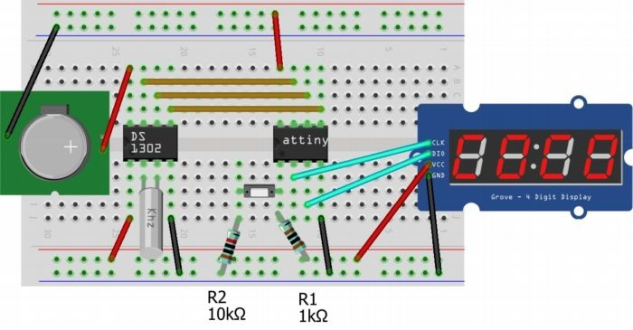

# ATTINY13 CLOCK

## Requiments
* [MicroCore](https://github.com/MCUdude/MicroCore)
* Arduino as ISP

## Components
- ATtiny13
- TM1637 
- DS1302
- Oscillator 32768Hz
- 1K and 10K resistors
- Push button

## Connection circuit

## Sources
* [How To use reset pin](https://electronics.stackexchange.com/a/195203)
* [TM1637 Library](https://github.com/lpodkalicki/attiny-tm1637-library)
* [DS1302 Watch](https://github.com/JanoVel/attiny_binary_watch)